### DEPLOYING APPLICATIONS INTO KUBERNETES CLUSTER

- In this project, you will build upon your knowledge of Kubernetes architecture, and begin to deploy applications on a K8s cluster. Kubernetes has a lot of moving parts; it operates with several layers of abstraction between your application and host machines where it runs. So many terms, and capabilities that is not realistic to learn it all at once. Hence, you will be introduced to as many concepts as possible, but gradually.

- Within this project we are going to learn and see in action following 

1.  Deployment of software applications using YAML manifest files with following K8s objects:

    *  Pods
    *  ReplicaSets
    *  Deployments
    *  StatefulSets
    *  Services (ClusterIP, NodeIP, Loadbalancer)
    *  Configmaps
    *  Volumes
    * PersistentVolumes
    * PersistentVolumeClaims …and many more

2. Difference between stateful and stateless applications

    * Deploy MySQL as a StatefulSet and explain why

3. Limitations of using manifests directly to deploy on K8s

    * Working with Helm templates, its components and the most important parts – semantic versioning
    * Converting all the .yaml templates into a helm chart

4. Deploying more tools with Helm charts on AWS Elastic `Kubernetes Service (EKS)`

    * Jenkins
        * MySQL
        * Ingress Controllers (Nginx)

    * Cert-Manager
    * Ingress for Jenkins
    * Ingress for the actual application
5. Deploy Monitoring Tools

     * Prometheus
     * Grafana

6. Hybrid CI/CD by combining different tools such as: `Gitlab CICD`, Jenkins. And, you will also be introduced to concepts around `GitOps` using `Weaveworks Flux`.

### Choosing the right Kubernetes cluster set up

- If you need something more robust, suitable for a production workload and with more advanced capabilities such as horizontal scaling of the worker nodes, then you can consider building own Kubernetes cluster from scratch just as you did in Project 21. If you have been able to automate the entire bootstrap using Ansible, you can easily spin up your nodes with Terraform, and configure the cluster with your Ansible configuration scripts.

- Tools responsible for different parts of your applications:

    * Terraform for infrastructure provisioning
    * Ansible for cluster master and worker nodes configuration
    * Kubernetes for deploying your containerized application and orchestrating the deployment

- Other options will be to leverage a `Managed Service` Kubernetes cluster from public cloud providers such as: `AWS EKS`, `Microsoft AKS`, or `Google Cloud Platform GKE`. 

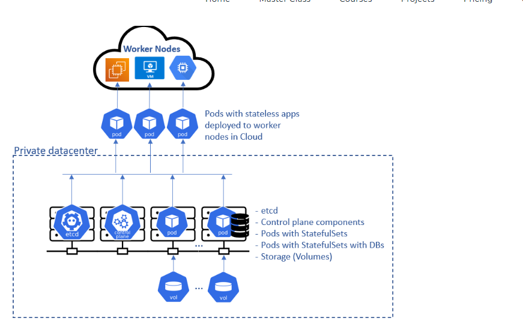

###  Deploying the `Tooling app` using Kubernetes objects

- In this section, you will begin to write configuration files for Kubernetes objects (they are usually referred as `manifests`) in the form of files with yaml syntax and deploy them using kubectl console. But first, let us understand what a `Kubernetes object` is.

- `Kubernetes objects` are persistent entities in the Kubernetes system. Kubernetes uses these entities to represent the state of your cluster. Specifically, they can describe:

    * What containerized applications are running (and on which nodes)
    * The resources available to those applications
    * The policies around how those applications behave, such as restart policies, upgrades, and fault-tolerance

## UNDERSTANDING THE CONCEPT and DEPLOYING APPLICATIONS INTO KUBERNETES CLUSTER

#### This project demonstrates how containerised applications are deployed as pods in Kubernetes and how to access the application from the browser.

- Creating a  cluster using AWS EKSCTL

        eksctl create cluster --name P22-EKS --region us-east-1 --nodegroup-name worker-nodes --node-type t3.small --managed --nodes 2

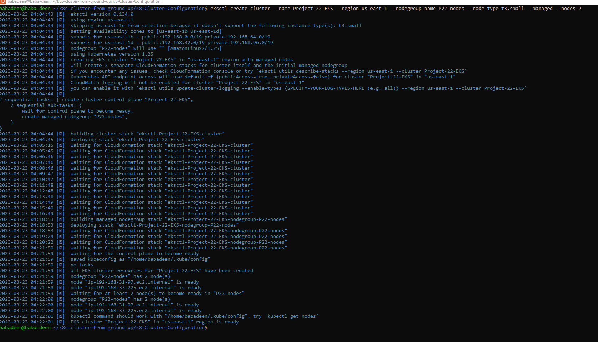

- commands to check if  the eks cluster is runing 

        eksctl get cluster --name P22-EKS --region us-east-1 
       
        kubectl get nodes

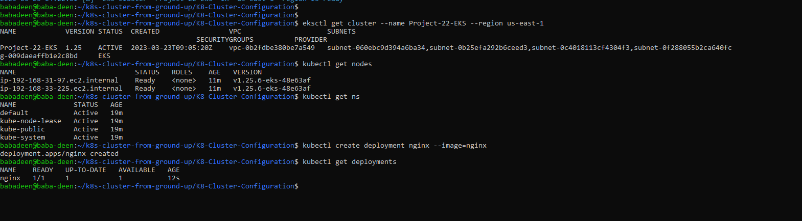

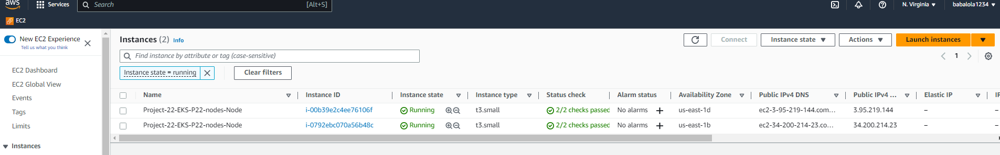

### STEP 1: Creating A Pod For The Nginx Application

* Creating nginx pod by applying the manifest file: nginx-pod.yaml manifest file shown below

        apiVersion: v1
        kind: Pod
        metadata:
            name: nginx-pod
            labels:
              app: nginx-pod
        spec:
          containers:
          - image: nginx:latest
            name: nginx-pod
        ports:
        - containerPort: 80
          protocol: TCP

* Run the below command to create the nginx pods 

          kubectl apply -f nginx-pod.yaml

          kubectl get pods

          kubectl describe pod nginx-pod

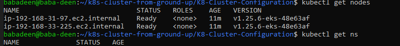

### Step 2 ACCESSING THE APP FROM THE BROWSER

- Now you have a running Pod. What’s next?

- The ultimate goal of any solution is to access it either through a web portal or some application (e.g., mobile app). We have a Pod with Nginx container, so we need to access it from the browser. But all you have is a running Pod that has its own IP address which cannot be accessed through the browser. To achieve this, we need another Kubernetes object called Service to accept our request and pass it on to the Pod.

- A service is an object that accepts requests on behalf of the Pods and forwards it to the Pod’s IP address. If you run the command below, you will be able to see the Pod’s IP address. But there is no way to reach it directly from the outside world

- Let us create a service to access the Nginx Pod

- Create a Service yaml manifest file:

        sudo cat <<EOF | sudo tee ./nginx-service.yaml
        apiVersion: v1
        kind: Service
        metadata:
            name: nginx-service
        spec:
            selector:
            app: nginx-pod 
            ports:
            - protocol: TCP
             port: 80
             targetPort: 80
        EOF

- Create a nginx-service resource by applying your manifest

        kubectl apply -f nginx-service.yaml

- Check the created service

        kubectl get service

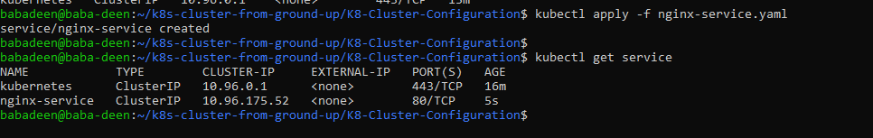

- Now that we have a service created, how can we access the app? Since there is no public IP address, we can leverage kubectl's port-forward functionality.

- 8089 is an arbitrary port number on your laptop or client PC, and we want to tunnel traffic through it to the port number of the nginx-service 80

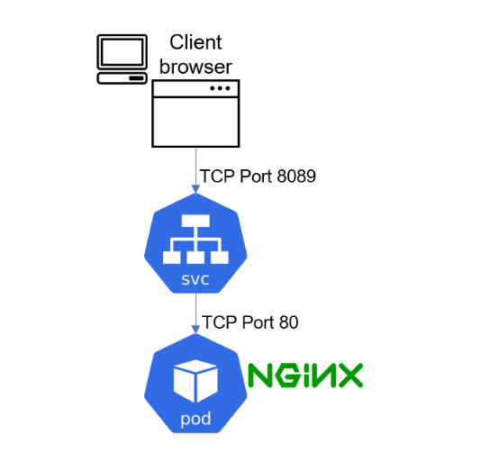

- run the comand below 

        kubectl  port-forward svc/nginx-service 8089:80

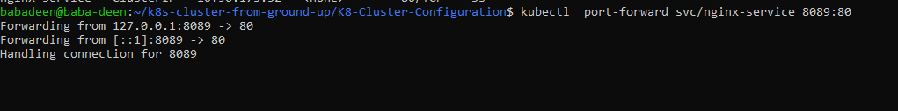

- then go to your web browser and enter `localhost:8089` – You should now be able to see the nginx page in the browser.

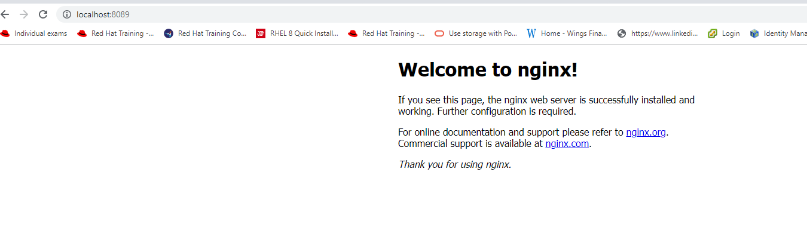

- Another way of accessing the Nginx app through browser is the use of NodePort which is a type of service that exposes the service on a static port on the node’s IP address and they range from 30000-32767 by default.

- Editing the nginx-service.yml manifest file to expose the Nginx service in order to be accessible to the browser by adding NodePort as a type of service:

# Step 2 CREATING A REPLICA SET

- Let us create a `rs.yaml` manifest for a ReplicaSet object

                apiVersion: apps/v1
        kind: ReplicaSet
        metadata:
        name: nginx-rs
        labels:
            app: nginx-pod
            tier: frontend
        spec:
        replicas: 3
        selector:
            matchLabels:
            tier: frontend
        template:
            metadata:
            name: nginx-pod
            labels:
                app: nginx-pod
                tier: frontend
            spec:
            containers:
            - image: nginx:latest
                name: nginx-pod
                ports:
                - containerPort: 80
                protocol: TCP
                

- run the below command 

        kubectl apply -f rs.yaml

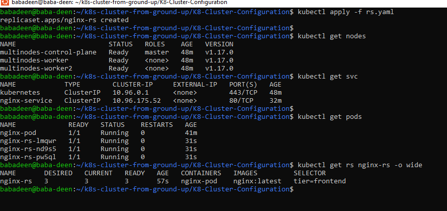

- Two ways pods can be scaled: Imperative and Declarative

1. Imperative method is by running a command on the CLI: 
    
         kubectl scale --replicas 5 replicaset nginx-rs

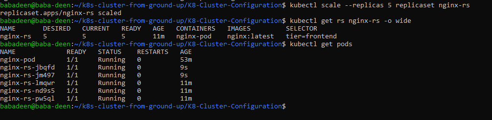

2. Declarative method is done by editing the `rs.yaml `manifest and changing to the desired number of replicas and applying the update

# STEP 4: Creating Deployment

- A Deployment is another layer above ReplicaSets and Pods, It manages the deployment of ReplicaSets and allows for easy updating of a ReplicaSet as well as the ability to roll back to a previous version of deployment. 

- Deleting the ReplicaSet that was created before: 

         kubectl delete rs nginx-rs

- Creating deployment manifest file called `deployment.yaml` applying it:

        apiVersion: apps/v1
        kind: Deployment
        metadata:
        name: nginx-deployment
        labels:
            tier: frontend
        spec:
        replicas: 4
        selector:
            matchLabels:
            tier: frontend
        template:
            metadata:
            labels:
                tier: frontend
            spec:
            containers:
            - name: nginx
                image: nginx:latest
                ports:
                - containerPort: 80

- applying it:

         kubectl apply -f deployment.yaml
 
 - Inspecting the setup

        kubectl get pods -o wide

        kubectl get pods

        kubectl get deployment  nginx-deployment -o wide

        kubectl get rs

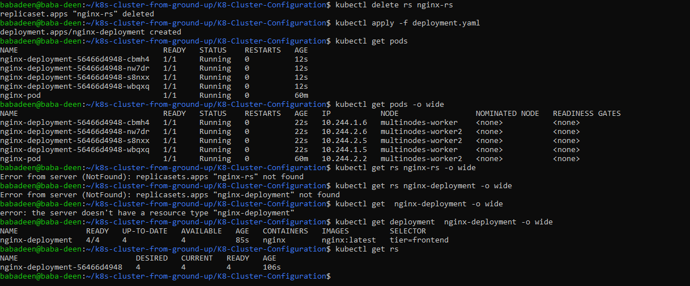

- To exec into one of the pods:

        kubectl exec nginx-deployment-56466d4948-nw7dr -i -t -- bash

- List the files and folders in the Nginx directory

        ls -ltr /etc/nginx/

- Check the content of the default Nginx configuration file

        cat  /etc/nginx/conf.d/default.conf

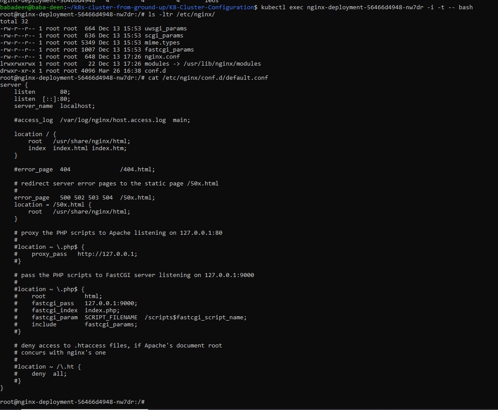

- Now, as we have got acquaited with most common Kubernetes workloads to deploy applications:

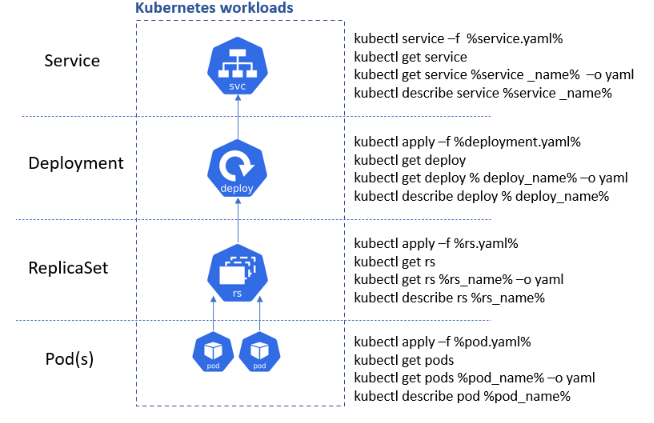

# Step 5 PERSISTING DATA FOR PODS

- Deployments are stateless by design. Hence, any data stored inside the Pod’s container does not persist when the Pod dies.

- If you were to update the content of the `index.html` file inside the container, and the Pod dies, that content will not be lost since a new Pod will replace the dead one.

- scale down the deployment to 1 

         kubectl scale --replicas 1 deployment nginx-deployment

![image of scled down]

- Exec into the running container and Install vim so that you can edit the file

        kubectl exec nginx-deployment-56466d4948-nw7dr -i -t -- bash

        apt-get update

        apt-get install vim

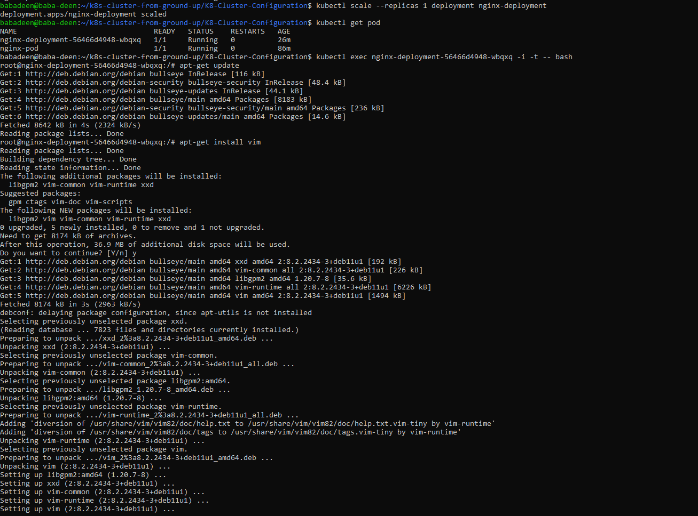

- Update the content of the file and add the code below `/usr/share/nginx/html/index.html`

        <!DOCTYPE html>
        <html>
        <head>
        <title>Welcome to DAREY.IO!</title>
        
        </head>
        <body>
        <h1>Welcome to DAREY.IO!</h1>
        
I am happy to learn from DAREY.IO and its an amazing experience form me to learn kubernetes as well.

        
Learning by doing is absolutely the best strategy at
        <a href="http://DAREY.IO/">DARE.IO</a>. 
        for skill aquistion  at
        <a href="http://DAREY.IO/">DAREY.IO</a>.

        
<em>Thank you for DARE for giving an opportunity to learn from you.</em>

        </body>
        </html>

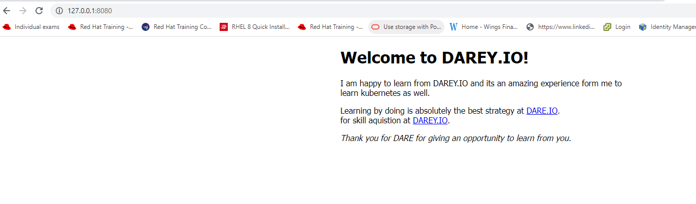

